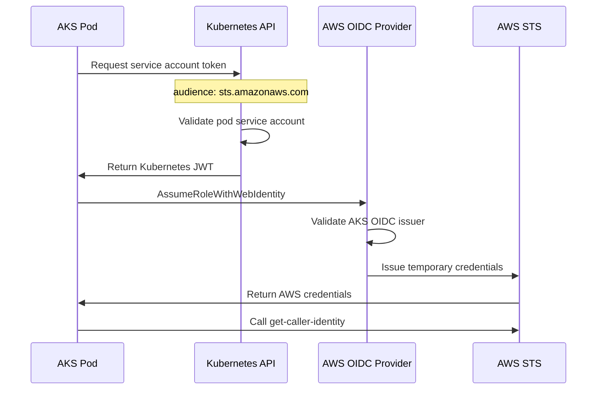
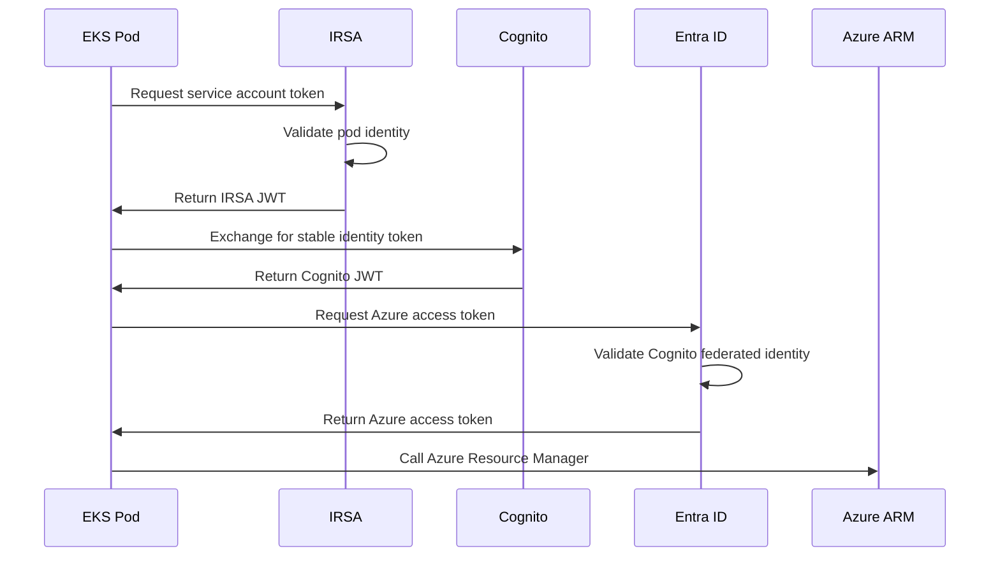

# Architecture: Cross-Cloud Authentication Without Secrets

## Overview
This demo proves bidirectional cross-cloud authentication between AWS and Azure using zero manually managed secrets. **Importantly, the authentication flows are intentionally asymmetric**, showcasing two different valid approaches to the same problem - each with distinct trade-offs.

## Components

### AWS Infrastructure
- **EKS Cluster**: Kubernetes with IRSA enabled
- **ECR Registry**: Container image storage  
- **IAM Role**: `AKSWorkloadRole` - assumed by AKS workloads via direct OIDC
- **OIDC Provider**: Trusts AKS cluster issuer directly
- **Cognito Identity Pool**: Issues stable OIDC tokens for EKS → Azure flow

### Azure Infrastructure  
- **AKS Cluster**: Kubernetes with OIDC issuer enabled (no Workload Identity needed)
- **ACR Registry**: Container image storage
- **Service Principal**: `EKSWorkloadSP` - assumed by AWS EKS workloads
- **Federated Identity**: Trusts Cognito JWT tokens from AWS

## Authentication Flows

### AKS → AWS Authentication (Simple, Kubernetes-Native)


### EKS → Azure Authentication (Enterprise-Stable Issuer)


## Architectural Trade-offs

The asymmetric flows highlight different approaches to cross-cloud authentication:

### AKS → AWS: Simple & Kubernetes-Native
**Approach**: Direct OIDC trust between AKS and AWS  
**Pros**:
- ✅ Actually works, since Entra won't issue an OIDC token via Entra Workload ID
- ✅ Minimal complexity - just Kubernetes + AWS OIDC provider  
- ✅ No additional cloud identity services needed
- ✅ Kubernetes-native service account tokens
- ✅ Lower cost (fewer services involved)

**Cons**:
- ⚠️ OIDC issuer URL changes if AKS cluster is recreated
- ⚠️ Tight coupling between specific cluster and AWS trust
- ⚠️ Requires updating AWS OIDC provider for new clusters

### EKS → Azure: Stable & Enterprise-Ready  
**Approach**: Cognito provides stable issuer for Azure federated identity  
**Pros**:
- ✅ Stable issuer URL survives EKS cluster recreation
- ✅ Cognito provides consistent identity endpoint
- ✅ Enterprise-friendly for cluster lifecycle management
- ✅ Decouples cluster identity from trust configuration

**Cons**:
- ⚠️ More complex - requires Cognito configuration
- ⚠️ Additional AWS service (Cognito) adds cost
- ⚠️ More moving parts to maintain

### Key Insights

#### Why Identity Pool (Not User Pool)?
**Critical Discovery**: Azure Entra ID Workload Identity **cannot issue OIDC JWTs** that external services can consume. It only issues access tokens for Azure resources.

- ❌ **Doesn't Work**: Azure Workload ID → OIDC JWT → AWS STS  
- ✅ **Works**: Azure Workload ID → Direct Kubernetes JWT → AWS STS
- ✅ **Works**: AWS IRSA → Cognito Identity Pool → OIDC JWT → Azure Entra

#### Architectural Trade-offs

| Flow | AKS → AWS (Simple) | EKS → Azure (Stable) |
|------|-------------------|---------------------|
| **Complexity** | ✅ Minimal (direct K8s OIDC) | ⚠️ More complex (Cognito) |
| **Stability** | ⚠️ Issuer changes with cluster | ✅ Stable Cognito issuer |
| **Cost** | ✅ Lower (fewer services) | ⚠️ Higher (Cognito costs) |
| **Enterprise** | ⚠️ Tight cluster coupling | ✅ Decoupled from clusters |


Both approaches are valid! The choice depends on your priorities:
- **Simplicity** → AKS → AWS approach  
- **Stability** → EKS → Azure approach

## Cross-Cloud Trust Setup

### AWS IAM Role Trust Policy (AKS → AWS)
```json
{
  "Version": "2012-10-17",
  "Statement": [
    {
      "Effect": "Allow",
      "Principal": {
        "Federated": "arn:aws:iam::ACCOUNT:oidc-provider/oidc.region.azmk8s.io/uuid"
      },
      "Action": "sts:AssumeRoleWithWebIdentity",
      "Condition": {
        "StringEquals": {
          "oidc.region.azmk8s.io/uuid:sub": "system:serviceaccount:demo:workload-identity-sa",
          "oidc.region.azmk8s.io/uuid:aud": "sts.amazonaws.com"
        }
      }
    }
  ]
}
```

### Azure Federated Identity Credential (EKS → Azure)
```json
{
  "name": "EKSWorkloadCredential",
  "issuer": "https://cognito-identity.REGION.amazonaws.com/IDENTITY_POOL_ID",
  "subject": "system:serviceaccount:demo:workload-identity-sa", 
  "audience": "api://AzureADTokenExchange"
}
```

## Applications

### AKS → AWS App  
- **Language**: Python
- **Dependencies**: boto3 (no Azure libraries needed!)
- **Function**: Calls `sts.get_caller_identity()` to prove AWS access
- **Authentication**: Reads Kubernetes service account JWT directly
- **Registry**: ACR (Azure Container Registry)

### EKS → Azure App  
- **Language**: Python
- **Dependencies**: azure-identity, azure-mgmt-resource, PyJWT
- **Function**: Calls Azure Resource Manager to prove Azure access
- **Authentication**: IRSA → Cognito → Azure Service Principal
- **Registry**: ECR (AWS Elastic Container Registry)

## Security Model

### Zero Secrets
- No static API keys, passwords, or certificates
- All authentication uses short-lived tokens
- Identity bound to specific workloads via service accounts

### Least Privilege
- IAM roles limited to minimum required permissions
- Service principals scoped to specific resources
- Kubernetes RBAC restricts pod capabilities

### Audit Trail
- All authentication events logged in CloudTrail (AWS)
- Activity logs capture access in Azure
- Kubernetes audit logs track pod activities

## Deployment

### Prerequisites
```bash
# Required environment variables, ironic right?
export AWS_ACCESS_KEY_ID=...
export AWS_SECRET_ACCESS_KEY=...
```

### Infrastructure as Code
All resources deployed via Terraform:
- `terraform/aws/` - EKS, ECR, IAM roles
- `terraform/azure/` - AKS, ACR, Service Principal
- `terraform/federated/` - Cross-cloud trust configuration

### Container Build
Docker images built and pushed to respective registries:
- AKS app → ACR
- EKS app → ECR