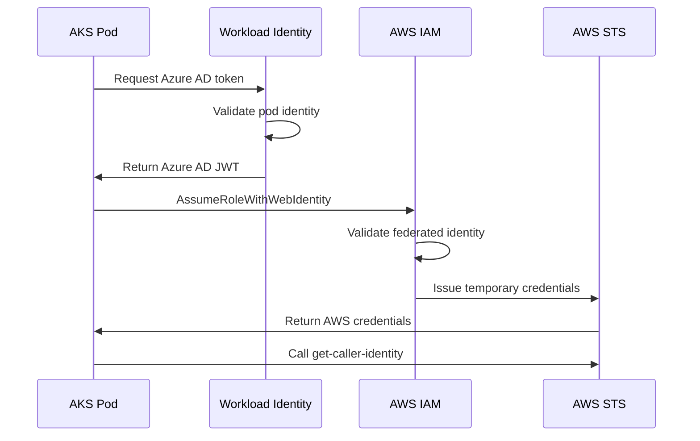
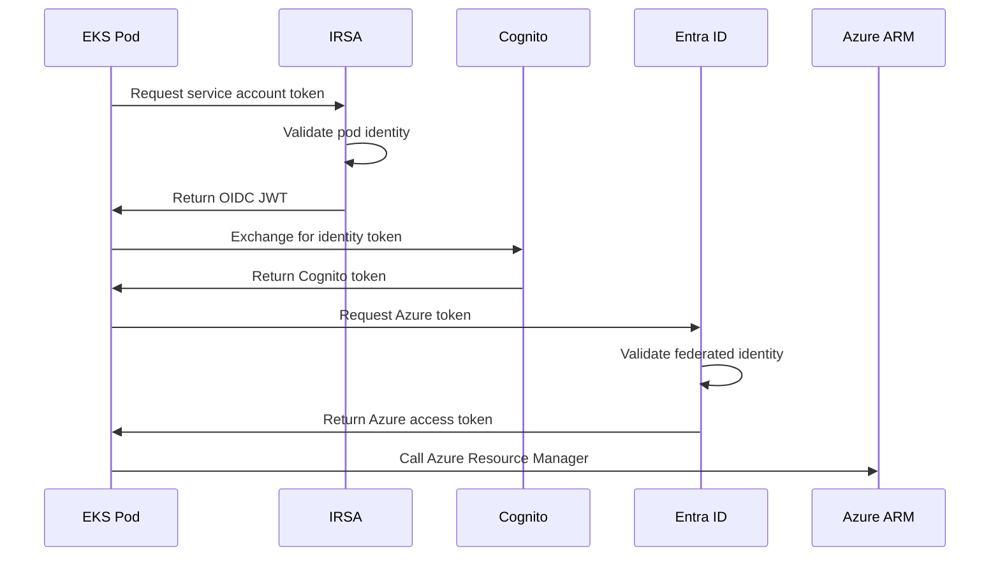

# Architecture: Cross-Cloud Authentication Without Secrets

## Overview
This demo proves bidirectional cross-cloud authentication between AWS and Azure using zero manually managed secrets. Applications in each cloud can authenticate to the other cloud provider using native identity services.

## Components

### AWS Infrastructure
- **EKS Cluster**: Kubernetes with IRSA enabled
- **ECR Registry**: Container image storage
- **IAM Role**: `AKSWorkloadRole` - assumed by Azure AKS workloads
- **Cognito Identity Pool**: Issues OIDC tokens for federated identity

### Azure Infrastructure  
- **AKS Cluster**: Kubernetes with Workload Identity enabled
- **ACR Registry**: Container image storage
- **Service Principal**: `EKSWorkloadSP` - assumed by AWS EKS workloads
- **Federated Identity**: Trusts AWS IAM for token exchange

## Authentication Flows

### AKS → AWS Authentication


### EKS → Azure Authentication


## Cross-Cloud Trust Setup

### AWS IAM Role Trust Policy
```json
{
  "Version": "2012-10-17",
  "Statement": [
    {
      "Effect": "Allow",
      "Principal": {
        "Federated": "arn:aws:iam::ACCOUNT:oidc-provider/sts.windows.net/TENANT_ID/"
      },
      "Action": "sts:AssumeRoleWithWebIdentity",
      "Condition": {
        "StringEquals": {
          "sts.windows.net/TENANT_ID/:sub": "SERVICE_PRINCIPAL_ID"
        }
      }
    }
  ]
}
```

### Azure Federated Identity Credential
```json
{
  "name": "EKSWorkloadCredential",
  "issuer": "https://oidc.eks.REGION.amazonaws.com/id/CLUSTER_ID",
  "subject": "system:serviceaccount:demo:workload-identity-sa",
  "audience": "sts.amazonaws.com"
}
```

## Applications

### AKS → AWS App
- **Language**: Python
- **Dependencies**: boto3, azure-identity
- **Function**: Calls `sts.get_caller_identity()` to prove AWS access
- **Registry**: ACR (Azure Container Registry)

### EKS → Azure App  
- **Language**: Python
- **Dependencies**: azure-identity, azure-mgmt-resource
- **Function**: Calls Azure Resource Manager to prove Azure access
- **Registry**: ECR (AWS Elastic Container Registry)

## Security Model

### Zero Secrets
- No static API keys, passwords, or certificates
- All authentication uses short-lived tokens
- Identity bound to specific workloads via service accounts

### Least Privilege
- IAM roles limited to minimum required permissions
- Service principals scoped to specific resources
- Kubernetes RBAC restricts pod capabilities

### Audit Trail
- All authentication events logged in CloudTrail (AWS)
- Activity logs capture access in Azure
- Kubernetes audit logs track pod activities

## Deployment

### Prerequisites
```bash
# Required environment variables, ironic right?
export AWS_ACCESS_KEY_ID=...
export AWS_SECRET_ACCESS_KEY=...
```

### Infrastructure as Code
All resources deployed via Terraform:
- `terraform/aws/` - EKS, ECR, IAM roles
- `terraform/azure/` - AKS, ACR, Service Principal
- `terraform/federated/` - Cross-cloud trust configuration

### Container Build
Docker images built and pushed to respective registries:
- AKS app → ACR
- EKS app → ECR