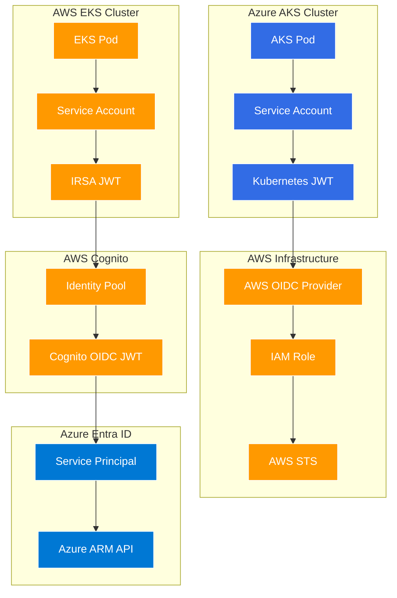
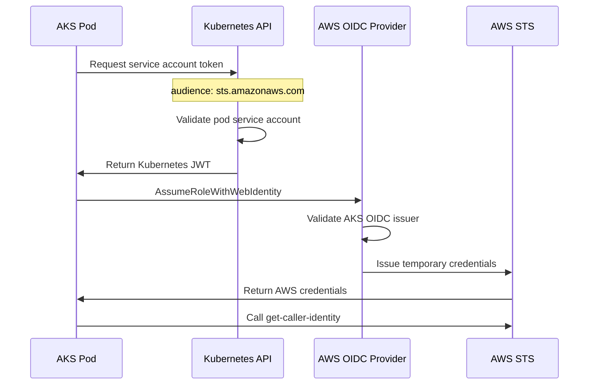
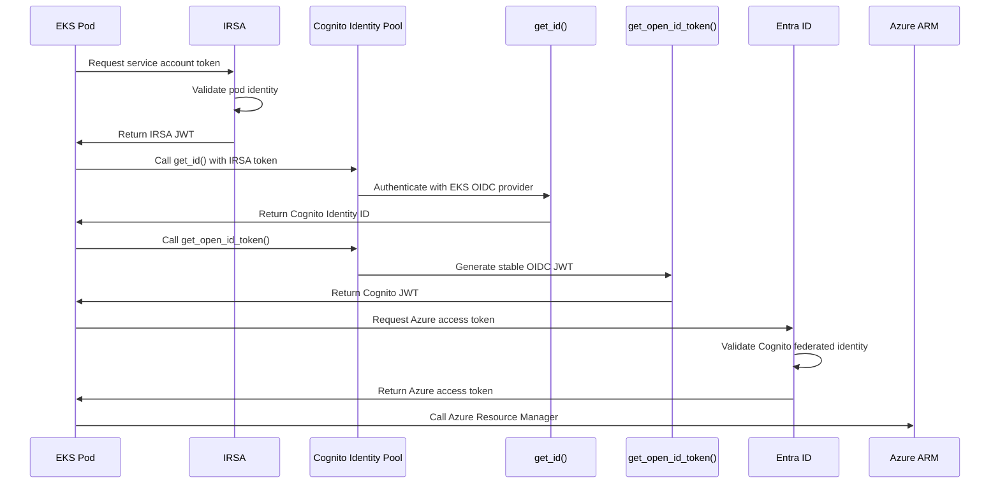

# BSides Las Vegas 2025 Demo: Cross-Cloud Authentication

This demo proves **bidirectional cross-cloud authentication without manually managed secrets** using modern identity federation patterns.

## 🚀 Quick Start

```bash
# Deploy everything
make deploy

# Verify authentication is working
make verify

# Clean up
make destroy
```

## 🏗️ Architecture Overview

This demo implements **asymmetric authentication flows** that showcase different valid approaches to the same problem:



### Detailed Authentication Flows

#### AKS → AWS (Simple, Kubernetes-Native)


#### EKS → Azure (Enterprise-Stable Issuer)


## 💰 Cost & Complexity

- **Demo cost**: ~$3-4/day while running 
- **Deploy time**: ~15 minutes
- **Destroy time**: ~5 minutes  
- **Secrets managed**: **0** 🎉
- **Code changes**: 899 lines added, 667 lines removed over development

## 🚨 Production Considerations

**This demo prioritizes cost and simplicity over production readiness:**

### Security Trade-offs
- **Public subnets** (no NAT Gateway) → Use private subnets in production
- **Single nodes** → Use 3+ nodes across AZs in production  
- **Minimal monitoring** → Add full observability stack in production

## 🎯 Demo Strategy

Since full deployment takes 20+ minutes (too slow for live demo), the presentation will show pre-deployed infrastructure with intentional failures at key points:

1. **Cloud Infrastructure**: IAM roles not configured to trust OIDC providers  

IAM IdP has a bad issuer, AKS cluster ID changed.
`kubectl logs -n demo deployment/aks-to-aws --tail=20 --follow` to check.
Fix in `terraform/aws/main.tf`, then `make deploy-aws`.

2. **Kubernetes Level**: IRSA (and/or AKS token projection) misconfigured, no OIDC token from service account

Missing the EKS service account annotation.
`kubectl -n demo get serviceaccount -o yaml` to check.
Fix at `k8s/eks-deployment.yaml`, then `make deploy-apps`.

3. **Application Level**: Authentication logic bugs in the applications

EKS application providing wrong format of login provider to the call to get the OIDC JWT.
Code fix, then `make build && make deploy-apps`. Might need a `kubectl -n demo delete pod <pod id>` to repull.

This breakdown demonstrates failures at infrastructure, Kubernetes, and application layers, a good spread. Can make some mermaid diagrams here to illustrate the break points maybe. Or just have one to point at to stay oriented.
